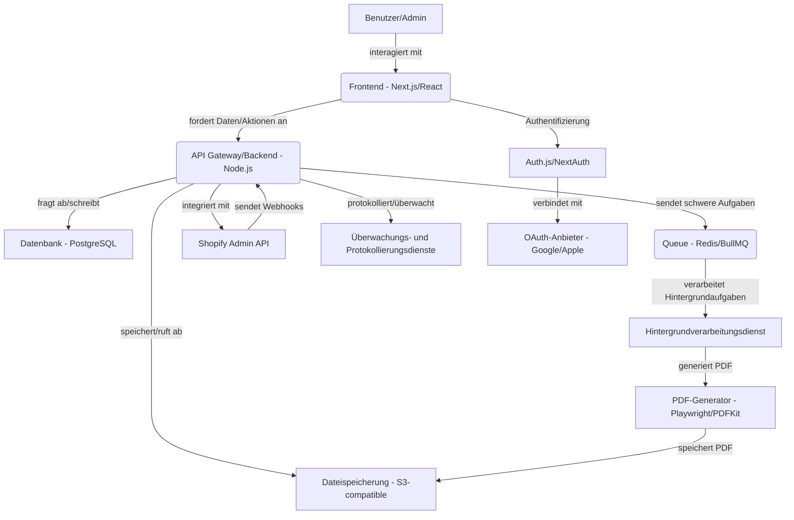

# Architekturvorschlag und Technologie-Stack

## Empfohlener Technologie-Stack

Basierend auf den Anforderungen empfehlen wir einen modernen und pragmatischen Technologie-Stack, der Leistung, Wartbarkeit, Kosten, Skalierbarkeit und Entwicklergeschwindigkeit in Einklang bringt:

*   **Frontend:** Next.js (App Router) + React + TypeScript + Tailwind CSS
    *   **Begründung:** Next.js bietet eine hervorragende Entwicklererfahrung, Leistungsoptimierungen (SSR, SSG), robustes Routing und TypeScript-Unterstützung. React gewährleistet eine interaktive und wiederverwendbare Benutzeroberfläche. Tailwind CSS bietet ein schnelles und flexibles Designsystem. Der App Router ist der neueste Ansatz in Next.js und bietet große Flexibilität.

*   **Backend:** Node.js (mit Express.js oder Fastify) + TypeScript
    *   **Begründung:** Node.js ist effizient im Umgang mit nicht blockierendem I/O, was es ideal für Webanwendungen macht, die eine schnelle Anforderungsverarbeitung erfordern. TypeScript gewährleistet Typsicherheit und bessere Wartbarkeit. Express.js oder Fastify können als leichtgewichtige und flexible Frameworks verwendet werden.

*   **Datenbank:** PostgreSQL
    *   **Begründung:** Eine robuste relationale Open-Source-Datenbank, bekannt für ihre Zuverlässigkeit, Skalierbarkeit und Unterstützung für erweiterte Funktionen wie JSONB. Geeignet zum Speichern strukturierter Daten wie Benutzer, Bestellungen und Rechnungen.

*   **ORM/Query Builder:** Prisma
    *   **Begründung:** Prisma bietet eine hervorragende Entwicklererfahrung mit typsicherer Generierung für TypeScript, was Fehler reduziert und die Entwicklung beschleunigt. Es unterstützt Datenbankmigrationen und bietet eine intuitive API für die Interaktion mit der Datenbank.

*   **Authentifizierung:** Auth.js (NextAuth.js)
    *   **Begründung:** Eine umfassende und flexible Authentifizierungslösung, die E-Mail/Passwort und soziale OAuth-Anbieter (Google, Apple) unterstützt. Integriert sich nahtlos in Next.js und bietet integrierte Sicherheitsfunktionen.

*   **Dateispeicherung:** S3-kompatible Lösung (z. B. AWS S3, MinIO, DigitalOcean Spaces)
    *   **Begründung:** Hoch skalierbarer und zuverlässiger Objektspeicher zum Speichern hochgeladener CSV-Dateien, generierter PDF-Rechnungen, Logos usw. Bietet Funktionen wie Lebenszyklusmanagement, Zugriffskontrolle und signierte URLs.

*   **Hintergrundverarbeitung:** Queue (z. B. Redis Queue, BullMQ)
    *   **Begründung:** Zur Verarbeitung schwerer Aufgaben wie der Analyse großer CSV-Dateien, PDF-Generierung und asynchroner Shopify-Synchronisierung. Verhindert das Blockieren des Frontends und verbessert die Reaktionsfähigkeit der Anwendung.

*   **PDF-Generator:** Playwright (für HTML zu PDF) oder PDFKit
    *   **Begründung:** Playwright bietet volle Kontrolle über das Rendern von HTML/CSS und die Konvertierung in PDF, was flexible und komplexe Rechnungsdesigns ermöglicht. Eine Alternative ist PDFKit zur programmgesteuerten PDF-Erstellung.

*   **Überwachung & Protokollierung:** Industriestandard-Lösungen (z. B. Prometheus/Grafana, ELK Stack, Datadog)
    *   **Begründung:** Unerlässlich für die Überwachung der Anwendungsleistung, Fehlererkennung und Verfolgung des Benutzerverhaltens. Hilft bei der schnellen Identifizierung und Lösung von Problemen.

*   **Serverless Functions (Optional):** (z. B. AWS Lambda, Vercel Functions)
    *   **Begründung:** Können für spezifische, hoch skalierbare Aufgaben wie die Verarbeitung von Shopify-Webhooks oder kleine Hintergrundaufgaben verwendet werden, um Infrastrukturkosten zu senken.

## Begründung der Auswahl

*   **Leistung:** Next.js mit SSR/SSG und Node.js bieten hohe Leistung und schnelle Reaktionszeiten. Die Hintergrundverarbeitung stellt sicher, dass lange Aufgaben das Frontend nicht blockieren.
*   **Wartbarkeit:** TypeScript, Prisma und die strukturierte Next.js-Architektur fördern Wartbarkeit und Lesbarkeit. Tailwind CSS reduziert CSS-Konflikte.
*   **Kosten:** PostgreSQL und Node.js sind Open-Source-Lösungen. S3-Lösungen und andere Cloud-Dienste können bei Skalierung kosteneffizient sein.
*   **Skalierbarkeit:** Alle ausgewählten Komponenten sind horizontal und vertikal skalierbar, um zukünftiges Wachstum zu bewältigen.
*   **Entwicklergeschwindigkeit:** Tools wie Next.js, React, TypeScript, Tailwind CSS und Prisma bieten eine hervorragende Entwicklererfahrung und beschleunigen den Entwicklungsprozess.

## Alternativen (mit Vor- und Nachteilen)

1.  **NestJS (Backend) + React (Frontend):**
    *   **Vorteile:** NestJS bietet eine robuste und strukturierte Architektur ähnlich wie Angular, was es hervorragend für große und komplexe Anwendungen macht. Unterstützt TypeScript nativ.
    *   **Nachteile:** Die Lernkurve kann für Entwickler, die neu bei NestJS sind, etwas steiler sein. Erfordert möglicherweise mehr Konfiguration im Vergleich zu leichtgewichtigeren Node.js-Lösungen.

2.  **Laravel (Backend) + Vue.js (Frontend):**
    *   **Vorteile:** Laravel ist ein robustes und ausgereiftes PHP-Framework, das viele integrierte Funktionen bietet (ORM, Routing, Authentifizierung). Vue.js ist ein leichtgewichtiges und einfach zu erlernendes Frontend-Framework.
    *   **Nachteile:** Erfordert eine PHP-Umgebung, was möglicherweise nicht bevorzugt wird, wenn sich das Team auf JavaScript/TypeScript konzentriert. In Szenarien mit starkem I/O möglicherweise nicht so effizient wie Node.js.

3.  **Ruby on Rails (Backend) + React (Frontend):**
    *   **Vorteile:** Rails ist bekannt für seine hohe Produktivität und Entwicklungsgeschwindigkeit. Hat ein reiches Ökosystem an Gems.
    *   **Nachteile:** Ruby ist möglicherweise weniger verbreitet als JavaScript/TypeScript. Die Leistung von Rails kann in einigen Fällen im Vergleich zu Node.js geringer sein.

## Diagramm der Hauptkomponenten (Mermaid)

**Erklärung der Komponenten:**

*   **Benutzer/Admin:** Interagiert mit der Anwendung über den Browser.
*   **Frontend (Next.js/React):** Die Webanwendung, die der Benutzer sieht und mit der er interagiert.
*   **API Gateway/Backend (Node.js):** Einstiegspunkt für alle Frontend-Anfragen, behandelt Geschäftslogik, Authentifizierung und Autorisierung.
*   **Datenbank (PostgreSQL):** Speichert alle strukturierten Daten der Anwendung.
*   **Dateispeicherung (S3-compatible):** Zum Speichern von CSV-Dateien, PDFs und Logos.
*   **Queue (Redis/BullMQ):** Warteschlangensystem für asynchrone Aufgaben.
*   **Hintergrundverarbeitungsdienst:** Verarbeitet Aufgaben aus der Warteschlange (z. B. CSV-Analyse, PDF-Generierung).
*   **PDF-Generator (Playwright/PDFKit):** Erstellt PDF-Dateien für Rechnungen.
*   **Shopify Admin API:** Zur Interaktion mit dem Shopify-Shop (Lesen von Bestellungen, Produkten, Kunden).
*   **Überwachungs- und Protokollierungsdienste:** Zum Sammeln von Protokollen und Metriken von allen Systemkomponenten.
*   **Auth.js/NextAuth:** Verwaltet den Authentifizierungsprozess für Benutzer.
*   **OAuth-Anbieter (Google/Apple):** Um soziale Anmeldung zu ermöglichen.
