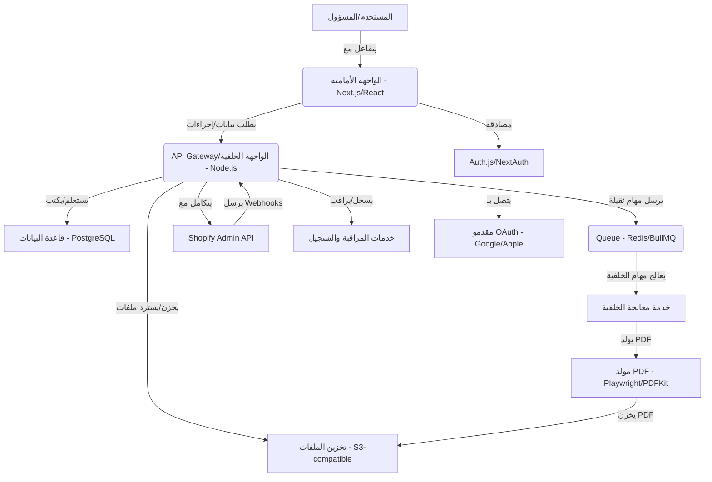

# اقتراح البنية المعمارية ومجموعة التقنيات

## مجموعة التقنيات الموصى بها

بناءً على المتطلبات، نوصي بمجموعة تقنيات حديثة وعملية توازن بين الأداء، قابلية الصيانة، التكلفة، قابلية التوسع، وسرعة المطورين:

*   **الواجهة الأمامية (Frontend):** Next.js (App Router) + React + TypeScript + Tailwind CSS
    *   **تبرير:** يوفر Next.js تجربة مطور ممتازة، تحسينات للأداء (SSR, SSG)، توجيهًا قويًا، ودعمًا لـ TypeScript. يضمن React واجهة مستخدم تفاعلية وقابلة لإعادة الاستخدام. يوفر Tailwind CSS نظام تصميم سريع ومرن. App Router هو أحدث نهج في Next.js ويوفر مرونة كبيرة.

*   **الواجهة الخلفية (Backend):** Node.js (مع Express.js أو Fastify) + TypeScript
    *   **تبرير:** Node.js فعال للتعامل مع I/O غير المحظور، مما يجعله مثاليًا لتطبيقات الويب التي تتطلب معالجة سريعة للطلبات. يضمن TypeScript قوة الأنواع وقابلية صيانة أفضل. يمكن استخدام Express.js أو Fastify لإطار عمل خفيف الوزن ومرن.

*   **قاعدة البيانات (Database):** PostgreSQL
    *   **تبرير:** قاعدة بيانات علائقية قوية ومفتوحة المصدر، معروفة بموثوقيتها، قابليتها للتوسع، ودعمها لميزات متقدمة مثل JSONB. مناسبة لتخزين البيانات المنظمة مثل المستخدمين، الطلبات، والفواتير.

*   **طبقة ORM/Query Builder:** Prisma
    *   **تبرير:** يوفر Prisma تجربة مطور ممتازة مع توليد أنواع آمنة لـ TypeScript، مما يقلل من الأخطاء ويسرع التطوير. يدعم ترحيل قاعدة البيانات ويوفر واجهة برمجة تطبيقات بديهية للتفاعل مع قاعدة البيانات.

*   **المصادقة (Authentication):** Auth.js (NextAuth.js)
    *   **تبرير:** حل مصادقة شامل ومرن يدعم البريد الإلكتروني/كلمة المرور، ومقدمي OAuth الاجتماعيين (Google, Apple). يتكامل بسلاسة مع Next.js ويوفر ميزات أمان مدمجة.

*   **تخزين الملفات (File Storage):** حل متوافق مع S3 (مثل AWS S3, MinIO, DigitalOcean Spaces)
    *   **تبرير:** تخزين كائنات قابل للتوسع للغاية وموثوق به لتخزين ملفات CSV التي تم تحميلها، وفواتير PDF التي تم إنشاؤها، والشعارات، وما إلى ذلك. يوفر ميزات مثل إدارة دورة الحياة، التحكم في الوصول، وتوقيع عناوين URL.

*   **معالجة الخلفية (Background Processing):** Queue (مثل Redis Queue, BullMQ)
    *   **تبرير:** لمعالجة المهام الثقيلة مثل تحليل ملفات CSV الكبيرة، وتوليد PDF، ومزامنة Shopify بشكل غير متزامن. يمنع حظر الواجهة الأمامية ويحسن استجابة التطبيق.

*   **مولد PDF:** Playwright (لتحويل HTML إلى PDF) أو PDFKit
    *   **تبرير:** يوفر Playwright تحكمًا كاملاً في عرض HTML/CSS وتحويله إلى PDF، مما يتيح تصميم فواتير مرنة ومعقدة. بديل له هو PDFKit لإنشاء PDF برمجيًا.

*   **مراقبة وتسجيل (Monitoring & Logging):** حلول قياسية للصناعة (مثل Prometheus/Grafana, ELK Stack, Datadog)
    *   **تبرير:** ضروري لمراقبة أداء التطبيق، اكتشاف الأخطاء، وتتبع سلوك المستخدم. يساعد في تحديد المشكلات وحلها بسرعة.

*   **الخوادم بدون خادم (Optional Serverless Functions):** (مثل AWS Lambda, Vercel Functions)
    *   **تبرير:** يمكن استخدامها لمهام محددة وقابلة للتوسع بشكل كبير، مثل معالجة الويب هوكس من Shopify أو مهام الخلفية الصغيرة، لتقليل تكاليف البنية التحتية.

## تبرير الخيارات

*   **الأداء:** Next.js مع SSR/SSG و Node.js يوفران أداءً عاليًا واستجابة سريعة. معالجة الخلفية تضمن عدم حظر المهام الطويلة للواجهة الأمامية.
*   **قابلية الصيانة:** TypeScript، Prisma، وهيكل Next.js المنظم يعززون قابلية الصيانة وقابلية القراءة. Tailwind CSS يقلل من تعارضات CSS.
*   **التكلفة:** PostgreSQL و Node.js حلول مفتوحة المصدر. يمكن أن تكون حلول S3 وخدمات السحابة الأخرى فعالة من حيث التكلفة مع التوسع.
*   **قابلية التوسع:** جميع المكونات المختارة قابلة للتوسع أفقيًا ورأسيًا لتلبية النمو المستقبلي.
*   **سرعة المطورين:** أدوات مثل Next.js، React، TypeScript، Tailwind CSS، و Prisma توفر تجربة مطور ممتازة وتسرع عملية التطوير.

## البدائل (مع الإيجابيات والسلبيات)

1.  **NestJS (Backend) + React (Frontend):**
    *   **الإيجابيات:** NestJS يوفر بنية قوية ومنظمة على غرار Angular، مما يجعله ممتازًا للتطبيقات الكبيرة والمعقدة. يدعم TypeScript بشكل أساسي.
    *   **السلبيات:** قد يكون منحنى التعلم أعلى قليلاً للمطورين الجدد على NestJS. قد يتطلب المزيد من التكوين مقارنة بحلول Node.js الأخف وزنًا.

2.  **Laravel (Backend) + Vue.js (Frontend):**
    *   **الإيجابيات:** Laravel هو إطار عمل PHP قوي وناضج يوفر العديد من الميزات المضمنة (ORM, توجيه، مصادقة). Vue.js إطار عمل واجهة أمامية خفيف الوزن وسهل التعلم.
    *   **السلبيات:** يتطلب بيئة PHP، والتي قد لا تكون مفضلة إذا كان الفريق يركز على JavaScript/TypeScript. قد لا يكون بنفس كفاءة Node.js في سيناريوهات I/O الثقيلة.

3.  **Ruby on Rails (Backend) + React (Frontend):**
    *   **الإيجابيات:** Rails معروف بإنتاجيته العالية وسرعة التطوير. لديه نظام بيئي غني بالgems.
    *   **السلبيات:** Ruby قد يكون أقل شيوعًا من JavaScript/TypeScript. قد يكون أداء Rails أقل في بعض الحالات مقارنة بـ Node.js.

## مخطط المكونات الرئيسية (ASCII Diagram)

**شرح المكونات:**

*   **المستخدم/المسؤول:** يتفاعل مع التطبيق عبر المتصفح.
*   **الواجهة الأمامية (Next.js/React):** تطبيق الويب الذي يراه المستخدم ويتفاعل معه.
*   **API Gateway/الواجهة الخلفية (Node.js):** نقطة الدخول لجميع طلبات الواجهة الأمامية، يتعامل مع منطق العمل، المصادقة، والتخويل.
*   **قاعدة البيانات (PostgreSQL):** تخزن جميع البيانات المنظمة للتطبيق.
*   **تخزين الملفات (S3-compatible):** لتخزين ملفات CSV، PDF، والشعارات.
*   **Queue (Redis/BullMQ):** نظام قائمة انتظار للمهام غير المتزامنة.
*   **خدمة معالجة الخلفية:** تعالج المهام من قائمة الانتظار (مثل تحليل CSV، توليد PDF).
*   **مولد PDF (Playwright/PDFKit):** يقوم بإنشاء ملفات PDF للفواتير.
*   **Shopify Admin API:** للتفاعل مع متجر Shopify (قراءة الطلبات، المنتجات، العملاء).
*   **خدمات المراقبة والتسجيل:** لجمع السجلات والمقاييس من جميع مكونات النظام.
*   **Auth.js/NextAuth:** يدير عملية المصادقة للمستخدمين.
*   **مقدمو OAuth (Google/Apple):** لتمكين تسجيل الدخول الاجتماعي.

